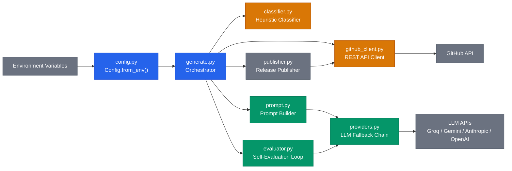
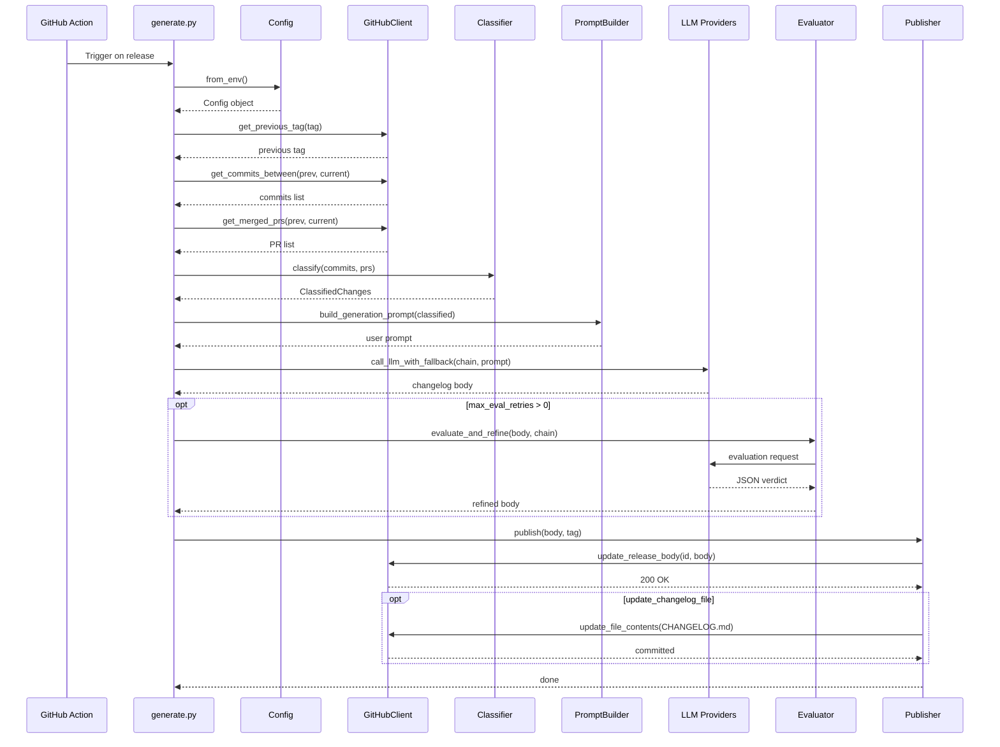
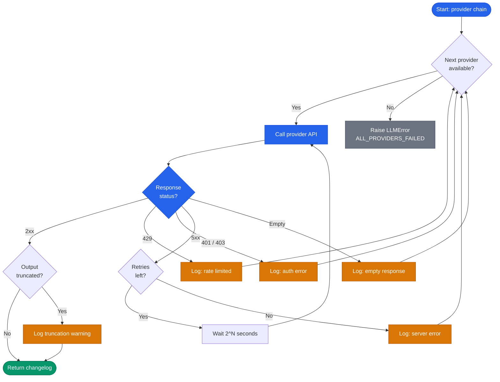
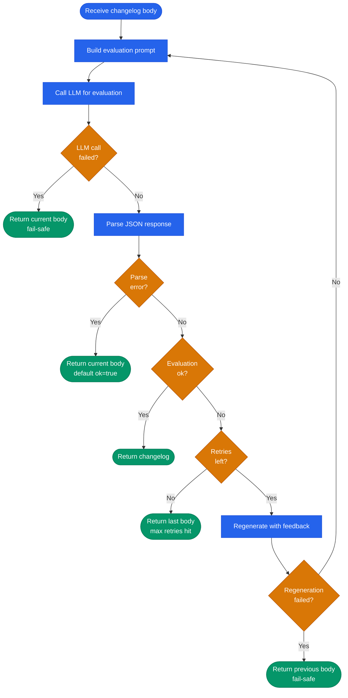

# Architecture

Detailed diagrams of the AI Changelog Generator internals.

## Component overview

**Legend:** blue = core orchestration, amber = data access/classification, green = LLM engine, grey = external systems.

## Pipeline sequence

End-to-end flow from GitHub Action trigger to published changelog.

## Provider fallback chain

How `call_llm_with_fallback` handles errors across providers. Each provider gets up to 3 retries on 5xx. Rate limits (429) and auth errors skip immediately to the next provider.

## Self-evaluation loop

The evaluator never blocks publishing. Every failure path returns the best available changelog body.

**Legend:** blue = processing steps, green = exit points (all return a changelog), amber = decision points.
